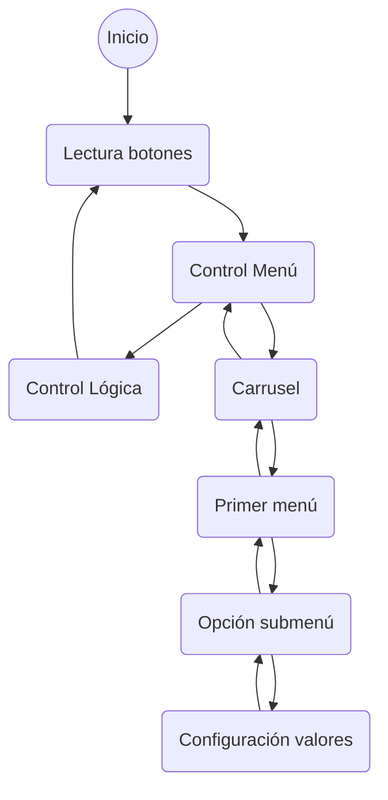

# Descripción del Firmware

## Máquina de estados
El sistema está basado principalmente en una gran máquina de estados que gestiona el menú de interfaz de usuario y por otro lado la administración de la lágica de control del dispositivo.

Las acciones de transición vienen dadas por el "click" del cursor de navegación dentro del menú.

## Espacios de memoria
El menú se reserva con un vector de vectores en donde todos los niveles son del mismo tamaño dado por el mayor. El final de un vector de menor tamaño lo determina la palabra clave "Volver".

| Menú  | 1° Renglon | 2° Renglon | 3° Renglon | 4° Renglon |
| :--: | :--: | :--: | :--: | :--: |
| Temperatura | Set point | Ripple | Unidad | Volver |
| Reloj|Modo | Tiempo | Reset | Volver |
| Ventilacion | Modo | Funcion | Velocidad | Volver |
| Iluminacion | Modo | Alarma | Brillo | Volver |
| *Wifi** | *Modo* | *SSIS* | *Nivel* | *Volver* |
| Sistema | Reiniciar | Encoder | Contraste | Volver |
|Salir|

**Funcionalidad no implementada*

Los valores se guardan en la memoria EEprom solo cuando sufren un cambio desde el menú de administración y se alojan en los siguientes espacios reservados:

    0x100 menuVal[0][0] = Temperatura medida
    0x104 menuVal[0][1] = Temperatura seleccionada
    0x108 menuVal[0][2] = Ripple
    0x112 menuVal[0][3] = Unidad temperatura
    0x116 menuVal[0][4] = Humedad medida
    0x120 menuVal[1][0] = -
    0x124 menuVal[1][1] = Modo reloj (Off/Cronometro/Temporizador)
    0x128 menuVal[1][2] = Tiempo en milisegundos
    0x132 menuVal[1][3] = Reset
    0x136 menuVal[1][4] = -
    0x140 menuVal[2][0] = -
    0x144 menuVal[2][1] = Modo ventilacion (Manual/Automatico)
    0x148 menuVal[2][2] = Función ventilación (Progresivo/Simultáneo)
    0x152 menuVal[2][3] = Velocidad PWM
    0x156 menuVal[2][4] = -
    0x160 menuVal[3][0] = -
    0x164 menuVal[3][1] = Modo iluminación (Off/On)
    0x168 menuVal[3][2] = Alarma iluminación (Off/On)
    0x172 menuVal[3][3] = Brillo PWM
    0x176 menuVal[3][4] = -
    0x180 menuVal[4][0] = Modo WIFI (Scan/AP)
    0x184 menuVal[4][1] = SSID
    0x188 menuVal[4][2] = Porencia dBm
    0x192 menuVal[4][3] = -
    0x196 menuVal[4][4] = -
    0x200 menuVal[5][0] = -
    0x204 menuVal[5][1] = Reinicio
    0x208 menuVal[5][2] = Sensibilidad rotary encoder
    0x216 menuVal[5][3] = Contraste pantalla
    0x220 menuVal[5][4] = -

Existe una opción de reinicio a modo de fábrica la cual, setea valores por defecto en estos espacios de memoria.

    menuVal[0][0] = 0
    menuVal[0][1] = 35
    menuVal[0][2] = 3
    menuVal[0][3] = 0
    menuVal[0][4] = 0
    menuVal[1][0] = 0
    menuVal[1][1] = 1
    menuVal[1][2] = 0
    menuVal[1][3] = 0
    menuVal[1][4] = 0
    menuVal[2][0] = 0
    menuVal[2][1] = 1
    menuVal[2][2] = 0
    menuVal[2][3] = 0
    menuVal[2][4] = 0
    menuVal[3][0] = 0
    menuVal[3][1] = 1
    menuVal[3][2] = 0
    menuVal[3][3] = 255
    menuVal[3][4] = 0
    menuVal[4][0] = 0
    menuVal[4][1] = 0
    menuVal[4][2] = 0
    menuVal[4][3] = 0
    menuVal[4][4] = 0
    menuVal[5][0] = 0
    menuVal[5][1] = 0
    menuVal[5][2] = 12
    menuVal[5][3] = 255
    menuVal[5][4] = 0

### Niveles del menú

El nivel cero es un carrusel el cual muestra dos pantallas rotativas cada 3 segundos, luego al hacer click con el cursos ingresa al primer nivel de menú en el cual se selecciona la opción a configurar, para ingresar a un segundo submenú en donde se elije el valor final que se desea personalizar.

## Funcionalidades

## Modo timer

## Modo ventiladores

## Funciones

# Releases
Para ver las características de cada una de las versiones ir a [Versiones.md](./Versiones.md)
