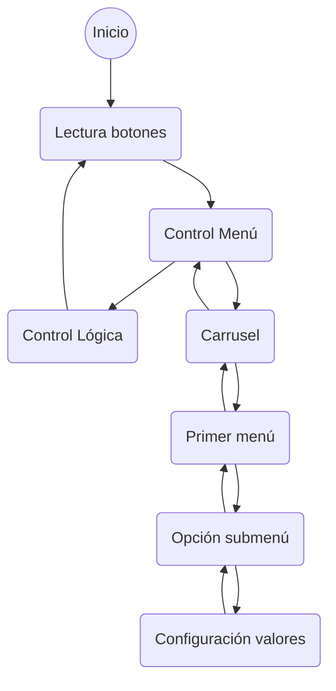

# Descripción del Firmware

## Máquina de estados
El sistema está basado principalmente en una gran máquina de estados que gestiona el menú de interfaz de usuario y por otro lado la administración de la lágica de control del dispositivo.

Las acciones de transición vienen dadas por el "click" del cursor de navegación dentro del menú.

## Espacios de memoria
El menú se reserva con un vector de vectores en donde todos los niveles son del mismo tamaño dado por el mayor. El final de un vector de menor tamaño lo determina la palabra clave "Volver".

| Menú  | 1° Renglon | 2° Renglon | 3° Renglon | 4° Renglon |
| :--: | :--: | :--: | :--: | :--: |
| Temperatura | Set point | Ripple | Unidad | Volver |
| Reloj|Modo | Tiempo | Reset | Volver |
| Ventilacion | Modo | Funcion | Velocidad | Volver |
| Iluminacion | Modo | Alarma | Brillo | Volver |
| *Wifi** | *Modo* | *SSIS* | *Nivel* | *Volver* |
| Sistema | Reiniciar | Encoder | Contraste | Volver |
|Salir|

**Funcionalidad no implementada*

### Niveles del menú

## Funcionalidades

## Modo timer

## Modo ventiladores

## Funciones

# Releases
Para ver las características de cada una de las versiones ir a [Versiones.md](./Versiones.md)
