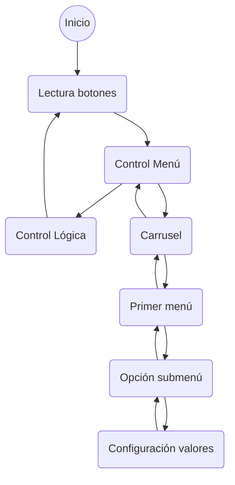

# Descripción del Firmware

## Máquina de estados
El sistema está basado principalmente en una gran máquina de estados que gestiona el menú de interfaz de usuario y por otro lado la administración de la lágica de control del dispositivo.

Las acciones de transición vienen dadas por el "click" del cursor de navegación dentro del menú.

## Espacios de memoria
El menú se reserva con un vector de vectores en donde todos los niveles son del mismo tamaño dado por el mayor. El final de un vector de menor tamaño lo determina la palabra clave "Volver".

| Menú  | 1° Renglon | 2° Renglon | 3° Renglon | 4° Renglon |
| :--: | :--: | :--: | :--: | :--: |
| Temperatura | Set point | Ripple | Unidad | Volver |
| Reloj|Modo | Tiempo | Reset | Volver |
| Ventilacion | Modo | Funcion | Velocidad | Volver |
| Iluminacion | Modo | Alarma | Brillo | Volver |
| *Wifi** | *Modo* | *SSIS* | *Nivel* | *Volver* |
| Sistema | Reiniciar | Encoder | Contraste | Volver |
|Salir|

**Funcionalidad no implementada*

Los valores se guardan en la memoria EEprom solo cuando sufren un cambio desde el menú de administración y se alojan en los siguientes espacios reservados:

    0x100 menuVal[0][0] = Temperatura medida
    0x104 menuVal[0][1] = Temperatura seleccionada
    0x108 menuVal[0][2] = Ripple
    0x112 menuVal[0][3] = Unidad temperatura
    0x116 menuVal[0][4] = Humedad medida
    0x120 menuVal[1][0] = -
    0x124 menuVal[1][1] = Modo reloj (Off/Cronometro/Temporizador)
    0x128 menuVal[1][2] = Tiempo en milisegundos
    0x132 menuVal[1][3] = Reset
    0x136 menuVal[1][4] = -
    0x140 menuVal[2][0] = -
    0x144 menuVal[2][1] = Modo ventilacion (Manual/Automatico)
    0x148 menuVal[2][2] = Función ventilación (Progresivo/Simultáneo)
    0x152 menuVal[2][3] = Velocidad PWM
    0x156 menuVal[2][4] = -
    0x160 menuVal[3][0] = -
    0x164 menuVal[3][1] = Modo iluminación (Off/On)
    0x168 menuVal[3][2] = Alarma iluminación (Off/On)
    0x172 menuVal[3][3] = Brillo PWM
    0x176 menuVal[3][4] = -
    0x180 menuVal[4][0] = Modo WIFI (Scan/AP)
    0x184 menuVal[4][1] = SSID
    0x188 menuVal[4][2] = Porencia dBm
    0x192 menuVal[4][3] = -
    0x196 menuVal[4][4] = -
    0x200 menuVal[5][0] = -
    0x204 menuVal[5][1] = Reinicio
    0x208 menuVal[5][2] = Sensibilidad rotary encoder
    0x216 menuVal[5][3] = Contraste pantalla
    0x220 menuVal[5][4] = -

Existe una opción de reinicio a modo de fábrica la cual, setea valores por defecto en estos espacios de memoria.

    menuVal[0][0] = 0
    menuVal[0][1] = 35
    menuVal[0][2] = 3
    menuVal[0][3] = 0
    menuVal[0][4] = 0
    menuVal[1][0] = 0
    menuVal[1][1] = 1
    menuVal[1][2] = 0
    menuVal[1][3] = 0
    menuVal[1][4] = 0
    menuVal[2][0] = 0
    menuVal[2][1] = 1
    menuVal[2][2] = 0
    menuVal[2][3] = 0
    menuVal[2][4] = 0
    menuVal[3][0] = 0
    menuVal[3][1] = 1
    menuVal[3][2] = 0
    menuVal[3][3] = 255
    menuVal[3][4] = 0
    menuVal[4][0] = 0
    menuVal[4][1] = 0
    menuVal[4][2] = 0
    menuVal[4][3] = 0
    menuVal[4][4] = 0
    menuVal[5][0] = 0
    menuVal[5][1] = 0
    menuVal[5][2] = 12
    menuVal[5][3] = 255
    menuVal[5][4] = 0

### Niveles del menú

El nivel cero es un carrusel el cual muestra dos pantallas rotativas cada 3 segundos, luego al hacer click con el cursos ingresa al primer nivel de menú en el cual se selecciona la opción a configurar, para ingresar a un segundo submenú en donde se elije el valor final que se desea personalizar.

## Funcionalidades

### Longpress (5 seg)
En algunas ocaciones se puede mantener presionado el cursor para destrabar una segunda función al click. Por defecto, mantener presionado el botón por 5 segundos y luego soltarlo, ejecuta una segunda función, esta última acciona al soltar el botón.

### Apagado y encendido
Al conectar el jack de alimentación (12v) el equipo naturalmente enciende. Para apagar el equipo definitivamente se lo debe desconectar, pero tiene una función "Stand by" la cual se activa manteniendo presionado el botón por 5 segundos. En este modo el equipo corta todas las salidas y apaga la pantalla
Para encenderlo se realiza el mismo procedimiento, se mantiene presionado el botón por 5 segundos y el equipo vuelve a encerder.

### Stand by
Si el equipo transcurre más de 10 minutos sin ninguna actividad en los movimientos del cursor y la temperatura ambiente por debajo del set point entra en un modo stand by en donde solo queda monitoreando el estado de la temperatura para volver a encerder si algún evento lo despierta, como puede ser que la temperatura supere el set point seleccionado.

## Modo temporizador
Al iniciar el equipo o al resetear el reloj (Reloj >> Reset) comienza a contar el tiempo en la pantalla del carrusel. Se puede elegir la base desde donde comienza a contar en el menú Rejoj >> Tiempo. Se utiliza la misma base de tiempo tanto para el temporizador y el cronómetro.

## Modo cronómetro
De forma similar al modo temporizador, pero de manera inversa. Al iniciar el equipo o al resetear el reloj (Reloj >> Reset) comienza a contar el tiempo de forma descendente en la pantalla del carrusel. Se puede elegir la base desde donde comienza a contar en el menú Rejoj >> Tiempo.

## Modo ventilación
Puede ser manual o automático. En el modo manual se puede seleccionar la velocidad desde el menú (Ventilación >> Velocidad), la cual fija la velocidad de los ventiladores indistintamente de la temperatura que tenga en gabinete controlado.
En caso de seleccionar automático, el sistema regula la velocidad de los ventiladores en función de la temperatura interna del gabinete, la seteada como referencia (set point) y el riple.
Ambos modos se van a ver afectados por el tipo de función de ventilación seleccionada.

## Funcion ventilación
La función de ventilación busca disminuir el ruido ocacionado por los ventiladores. Existen dos formas de trabajo:
* Progresivo, a bajas potencias enciende solo un ventilador, a potencias medias enciende dos ventiladores y cuando requiere extraer mucho volumen termina encendiendo los tres ventiladores. Cada una de las etapas de encendido son escalonadas.
* Simultáneo, en esta forma de trabajo se encienden los tres ventiladores juntos con el nivel de potencia requerido para garantizar la estabilida de la temperatura interna.

## Funciones

### void display2 (void);
Actualiza la segunda pantalla del carrusel, se utiliza para activar la función de iluminación en el acto. Al estar situado en el carrusel, si se gira el cursor se puede ajustar el nivel de iluminación sin que este implique actualizar el seteo por default en el brillo. Cuando el equipo vuelve a encender tomará como parámetro el valor que tenga en Iluminación >> Brillo.

### void renglones (String, String, String, int);
Gestiona el sombreado de los renglones del menú y la colocación de las flehas de navegación. Trabaja en conjunto con los displayLnl's.

### void displayLvl1(int);
Dependiendo de la posición del cursor imprime de forma dinámica los renglones siguientes y anteriores.
*Puede tener problemas para imprimir líneas de menú con menos de 3 ítems.*

### void displayLvl2(int, int);
Dependiendo de la posición del cursor y el menú seleccionado imprime de forma dinámica el submenú.
*Es importante limitar el submenú con la palabra especial "Volver".*

### void displayLvl3(int, int);
Administra el cambio de las variables finales y tiene condiciones de personalización para cada tipo de dato.

### void printHorario (void);
Salida por terminal para bugging, imprime estado de los cursores para giros horarios.

### void printAntihorario (void);
Salida por terminal para bugging, imprime estado de los cursores para giros antihorarios.

### void printBoton (void
Salida por terminal para bugging, imprime estado de los cursores al presionar.

### void progresivo(byte);
Trabaja en función de "power". Con la siguiente condición:
* Para potencias por debajo de 30% enciende solo un ventilados.
* Para potencias entre 30 y 70% enciendo dos ventiladores.
* Para potencias mayores al 70% enciente los tres ventiladores.

### void power(void);
Determina el nivel de potencia aplicada al sistema de ventilación.
* Si se encuentra por debajo del límite inferior del (set point - riple) no enciende.
* Entre el límite inferior del (set point - riple) y el set point, enciende progresivamente hasta el 50%.
* Entre el set point y el límite superior del (set point + riple), enciende progresivamente hasta el 100%.
* Si se encuentra por sobre del límite superior del (set point + riple) enciende a máxima potencia.

# Releases
Para ver las características de cada una de las versiones ir a [Versiones.md](./Versiones.md)
