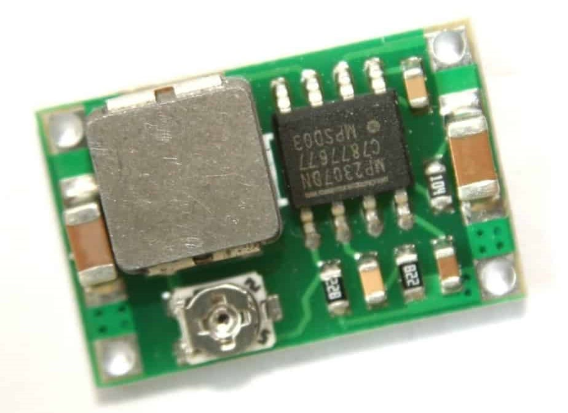

# Fuente mini 360

Basado en el [MP2307](https://cdn-shop.adafruit.com/datasheets/MP2307_r1.9.pdf), la fuente tiene regulación de tensión de salida, por lo cual por seguridad se hace una modificación con el fin de dejar fija la tensión de salida en 5V. Esta tensión es la misma que alimenta el microcontrolador ESP8266.
Originalmente el módulo tiene un divisor resistivo conformado por una resistencia de 8.2K y un potenciómetro.

La tensión de salida se regula según la siguiente ecuación:

$V_{OUT}=0.925.\frac{R_1+R_2}{R_2}$

Siendo R2 de 8.2K, el valor de la resistencia R1 debe ser de 36K, con lo que se obtienen 4.98V de salida.
Al levemente inferior a 5V puede generar un recalentamiento de la fuente cuando se enchufa el puerto USB del kit de desarrollo.

Con resistencias 1206 queda bien, pero también se podrá probar con 0805.

En caso de colocar un diodo de proyección a la salida, hay que tener en cuenta la caída del diodo, típicamente 0.7v.

$V_{OUT}=0.925.\frac{R_1+R_2}{R_2}=5.7V$

Siendo R2 de 8.2K, el valor de la resistencia R1 debe ser de 42K, con lo que se obtienen 5.77V de salida.
