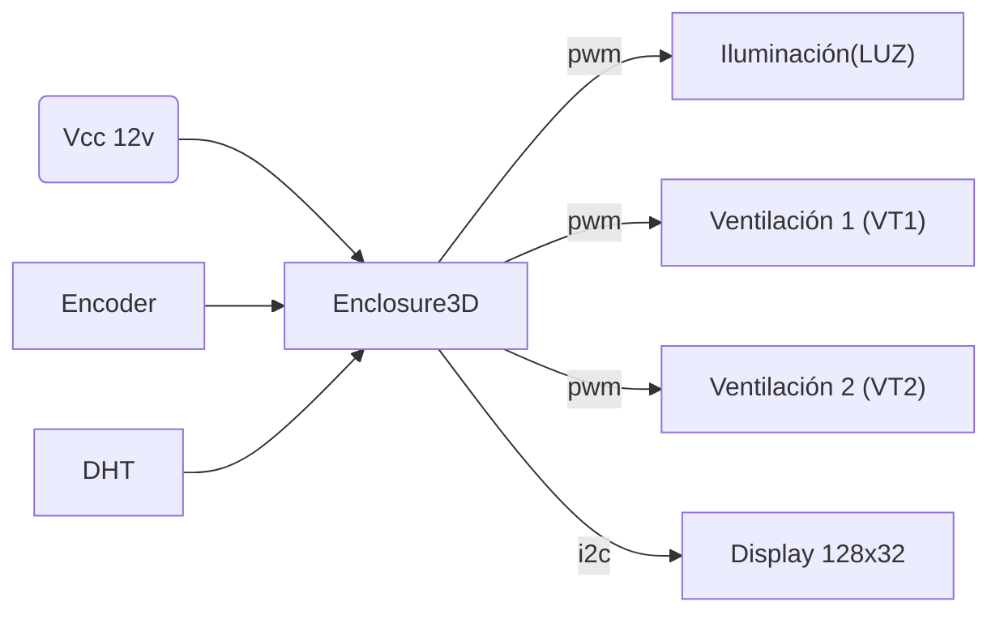

# Enclosure3D
[Cuartobe](https://www.cuartobe.ar/) se puso a diseñar un control de ambiente para un gabinete de impresión 3D y así mejorar la calidad de impresión, puedes ver más novedades en sus redes [Instagram](https://www.instagram.com/cuartobe.ar) y [TikTok](https://www.tiktok.com/@cuartobe.ar).

 ### Componentes
 * NodeMCU ESP8266 (compatible con V2 y V3)
 * Display 0.91" oled
 * Sensor de humedad y temperatura DHT11 o DHT22
 * Rotary encoder

## Parámetros técnicos
* Dimensiones: 105mm x 65mm x 33mm
* Material: PLA
* Alimentación: 12v CC
* Consumo: 

## Puertos
El dispositivo presenta 3 salidas para el control de ambiente:
* Iluminación (LUZ) 12v @ 1A.
* Ventilación (VT1) 12v @ 1A.
* Ventilación (VT2) 12v @ 2A.

### Diagrama de conexionado

# Proyecto
Es un proyecto Openfirmware en el cual se puede desarrollar sobre la arquitectura del ESP8266. Para saber más sobre el código puedes verlo y descargarlo desde la 
[sección de firmware](./Firmware/README.md) y si lo que más te gusta es diseñar, puedes proponer la próxima versión de la carcaza o personalizarla a tu propio estilo en la [sección de carcasa](./Carcasa/README.md).
