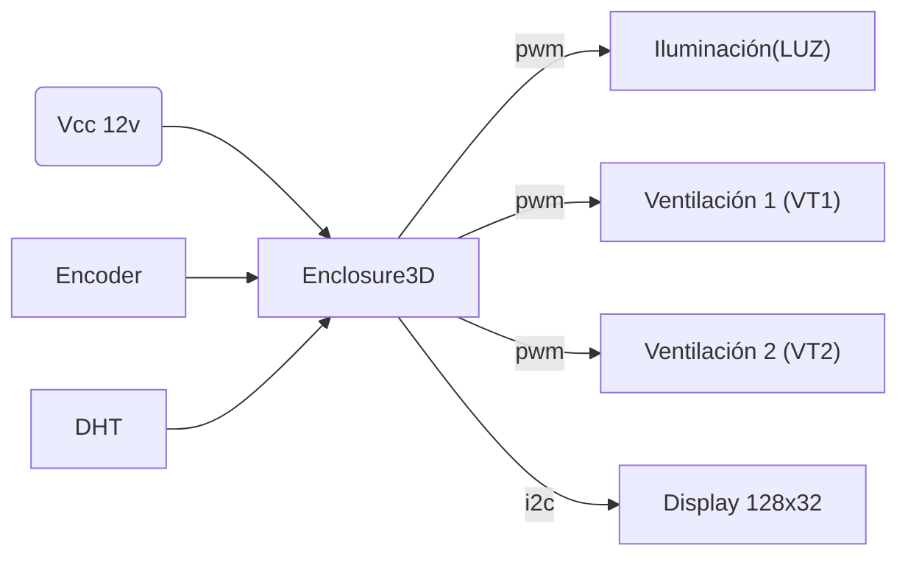

# Enclosure3D
Control de ambiente para un gabinete de impresión 3D

(Foto componentes)

 ### Componentes
 * NodeMCU 8266 V2 o V3
 * Display 0.91 oled
 * Sensor de humedad y temperatura DHT11 o DHT22
 * Rotary encoder

## Parámetros técnicos
* Dimensiones:  
* Material: PLA
* Alimentación: 12v CC
* Consumo: 

## Puertos
El dispositivo presenta 3 salidas para el control de ambiente:
* Iluminación (LUZ) 12v @ 1A.
* Ventilación (VT1) 12v @ 1A.
* Ventilación (VT2) 12v @ 2A.

### Diagrama de conexionado

